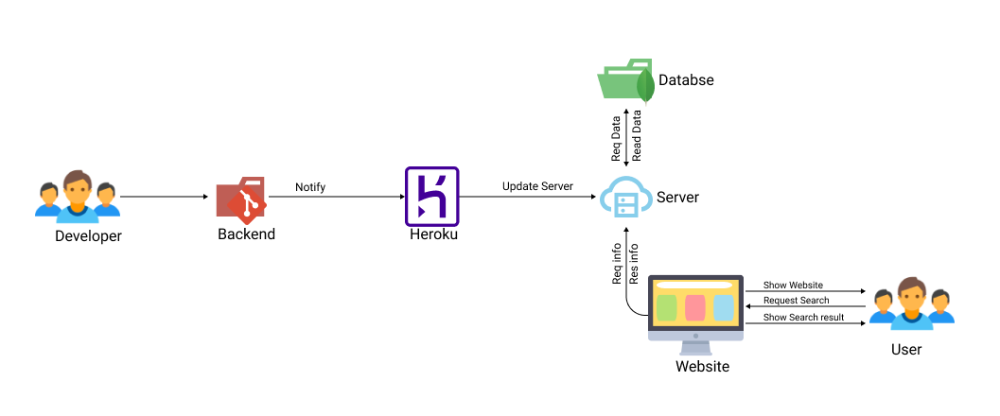

# ps1_avy

## Our Problem Statement : Website Search

## Team Name - AVY

| Team member         | Graduating year | College Name |
| ------------------- | :-------------: | -----------: |
| Abhishek Kumar      |      2022       |  IIIT Ranchi |
| Baki Yaswanth Reddy |      2022       |  IIIT Ranchi |
| Vimal Kumar         |      2022       |  IIIT Ranchi |

## This folder contains the files related to the website search's backend.

_Back-end :_ We will create a Restful Api (server), in which the server will retrieve user input as a string (The word that has been searched) from the front-end and then the server will search that keywords in mongoDB and then it will send the JSON data to the client (frontend).

]

## Tech Stack :

- Node.js
- Express.js
- MongoDB

## Thank You!
