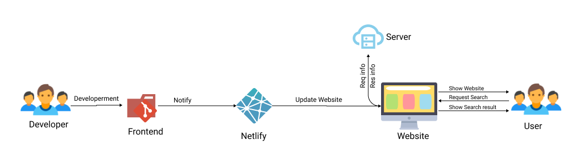

# ps1_avy

## Our Problem Statement : Website Search

## Team Name - AVY

| Team member         | Graduating year | College Name |
| ------------------- | :-------------: | -----------: |
| Abhishek Kumar      |      2022       |  IIIT Ranchi |
| Baki Yaswanth Reddy |      2022       |  IIIT Ranchi |
| Vimal Kumar         |      2022       |  IIIT Ranchi |

## This folder contains the files related to the website search's fronend.

_Front-end :_ We will create a web app based on ReactJs, in which we will request user input and send that input keyword to server through Rest Api, and then server will send that relevant data, then we will showcase that data to user in a nice, clean, user friendly and responsive interface. So that the user will be satisfied from the result.

## Tech Stack :

- React.js
- css
- Design : Figma

## Thank You!
