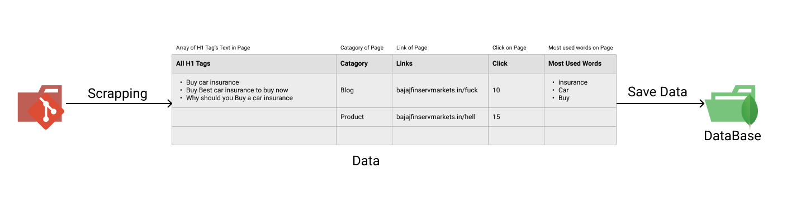

# ps1_avy

## Our Problem Statement : Website Search

## Team Name - AVY

| Team member         | Graduating year | College Name |
| ------------------- | :-------------: | -----------: |
| Abhishek Kumar      |      2022       |  IIIT Ranchi |
| Baki Yaswanth Reddy |      2022       |  IIIT Ranchi |
| Vimal Kumar         |      2022       |  IIIT Ranchi |

## This folder contains the files related to the website search's Scrapping.

_Web scraping:_ We have to explore all the pages contained in a website through site-map and extract data like (All H1 tag content , page url , most used words) from the web-pages using web scraping, then we have to saved that data in MongoDB.

## Tech Stack :

- Python
- ButifulSoup

## Thank You!
